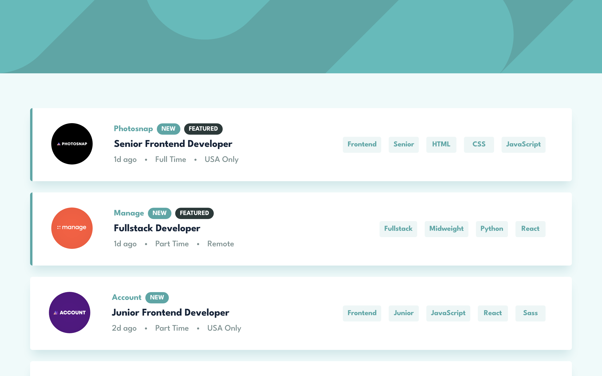
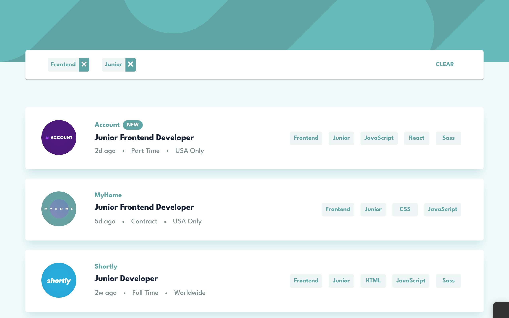
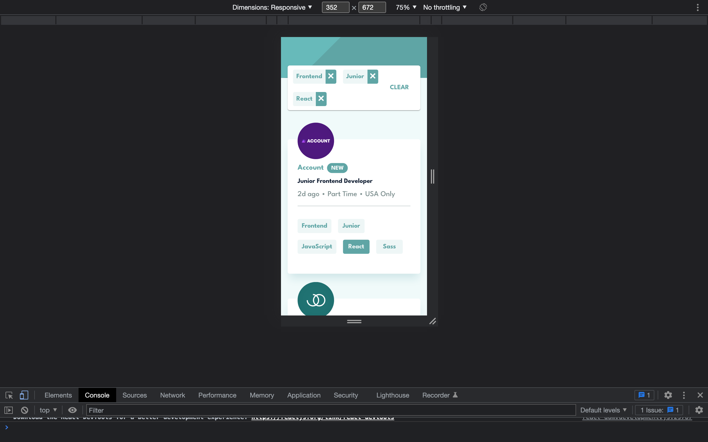

# Frontend Mentor - Job listings with filtering solution

This is a solution to the [Job listings with filtering challenge on Frontend Mentor](https://www.frontendmentor.io/challenges/job-listings-with-filtering-ivstIPCt). Frontend Mentor challenges help you improve your coding skills by building realistic projects.

## Table of contents

- [Overview](#overview)
  - [The challenge](#the-challenge)
  - [Screenshot](#screenshot)
  - [Links](#links)
- [My process](#my-process)
  - [Built with](#built-with)
- [Author](#author)

## Overview

### The challenge

Users should be able to:

- View the optimal layout for the site depending on their device's screen size
- See hover states for all interactive elements on the page
- Filter job listings based on the categories

### Screenshot

### Links

- Solution URL: [GitHub](https://github.com/mseidel819/static-job-listings)
- Live Site URL: [Netlify](https://astonishing-bavarois-d35327.netlify.app/)

## My process

### Built with

- Semantic HTML5 markup
- Material UI
- [React](https://reactjs.org/) - JS library
- Emotion - for styling components

**Note: These are just examples. Delete this note and replace the list above with your own choices**

## Author

- Website - [Matt Seidel](https://seidelmatt.com/)
- Frontend Mentor - [@mseidel819](https://www.frontendmentor.io/profile/mseidel819)
